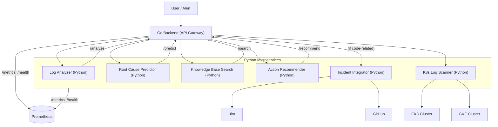

# AI-Powered Incident Resolution Assistant for DevOps Teams

## Project Overview
A smart assistant that helps DevOps/SRE teams diagnose and resolve production issues faster using AI. It leverages log analysis, knowledge base search, root cause prediction, and action recommendation—all powered by ML.

## Architecture
- **Go Backend**: Orchestrates requests, exposes unified API, and conditionally triggers the Incident Integrator for code-related incidents.
- **Python Microservices**:
  - **Log Analyzer**: ML-based anomaly detection (Isolation Forest + NLP)
  - **Root Cause Predictor**: ML classifier (LogisticRegression)
  - **Knowledge Base Search**: Semantic search (sentence-transformers + FAISS)
  - **Action Recommender**: ML-based (LogisticRegression)
  - **Incident Integrator**: Integrates with GitHub and Jira to automate ticketing and closure for code-related incidents.
- **K8s Log Scanner**: Scans logs from EKS and GKE Kubernetes clusters for incident detection.
- **React Frontend**: Modern web dashboard for monitoring services, analyzing incidents, and managing configuration.

### System Design Diagram



## Frontend Navigation & Structure

- **Dashboard** (route: `/`)
  - **Analytics Dashboard** (`/dashboard/analytics`)
  - **Incident Analytics** (`/dashboard/incident-analytics`)
  - **Real-Time Metrics** (`/dashboard/metrics`)
- **Incident Analyzer** (`/analyzer`)
- **K8s Log Scanner** (`/k8s`)
- **Configuration** (`/config`)

> **Note:** The Test Runner has been removed from the UI. All analytics and metrics are now nested under Dashboard for a cleaner, more intuitive navigation experience.

### Sidebar Customization
- To add or remove sidebar items, edit the `menuItems` array in `frontend/src/App.js`.
- To nest items, add a `children` array to a menu item.
- Update route paths in the `<Routes>` section to match sidebar structure.

### Extending the Dashboard
- To add new analytics widgets, create a new component in `frontend/src/components/` and add a route and sidebar entry as above.
- For drill-down analytics, use nested routes and pass parameters via URL or React Router state.

## K8s Log Scanner Cloud Requirements
- **EKS Support:**
  - AWS CLI and credentials must be available in the container.
  - Mount your AWS credentials and set `AWS_PROFILE` as needed.
- **GKE Support:**
  - Google Cloud SDK and `gke-gcloud-auth-plugin` must be installed in the container.
  - Mount your GCP credentials and ensure your kubeconfig uses the new `gke-gcloud-auth-plugin` (not the deprecated `gcp` auth-provider).
- See the `python-services/k8s_log_scanner/Dockerfile` for details.

## Setup & Running

### Prerequisites
- Docker & Docker Compose
- Python 3.10+ (for local dev/tests)
- Go 1.21+
- Node.js 18+ (for frontend dev)

### Local Development
1. Clone the repo and create a virtual environment:
   ```sh
   python3 -m venv venv
   source venv/bin/activate
   pip install -r python-services/requirements.txt
   ```
2. Copy `.env.example` to `.env` and fill in any required values.
3. Run tests:
   ```sh
   ./run_all_tests.sh
   ```

### Frontend Development
1. Navigate to the frontend directory and install dependencies:
   ```sh
   cd frontend
   npm install
   ```
2. Start the development server:
   ```sh
   npm start
   ```
3. The dashboard will be available at `http://localhost:3000`

### Docker Compose (Recommended)
1. Build and start all services:
   ```sh
   docker-compose up --build
   ```
2. The Go API will be available at `http://localhost:8080`.
3. The frontend will be available at `http://localhost:3000` (served by the new frontend Dockerfile/service).

#### Example `frontend` Dockerfile
```Dockerfile
FROM node:18
WORKDIR /app
COPY package*.json ./
RUN npm install
COPY . .
EXPOSE 3000
CMD ["npm", "start"]
```

#### Example `docker-compose.yml` entry
```yaml
  frontend:
    build:
      context: ./frontend
    ports:
      - "3000:3000"
    volumes:
      - ./frontend:/app
      - /app/node_modules
    environment:
      - CHOKIDAR_USEPOLLING=true
    depends_on:
      - go-backend
```

## API Endpoints

### Go Backend (Unified API)
- `POST /analyze` — Analyze logs for anomalies
- `POST /predict` — Predict root cause from logs
- `POST /search` — Search similar incidents (vector search)
- `POST /recommend` — Recommend actions based on root cause
- `POST /scan-k8s-logs` — Scan logs from Kubernetes clusters
- `GET /k8s-clusters` — List available Kubernetes clusters
- `GET /health` — Health check

### Python Microservices
Each exposes its own `/health`, `/metrics`, and main endpoint (see code for details).

## Configuration
- All services are configured via environment variables (see `.env.example`).
- ML model parameters and keywords can be set via env vars.

## Testing
- Run all tests (unit, integration, end-to-end):
  ```sh
  ./run_all_tests.sh
  ```
- See `test_e2e.py` for a full incident scenario test.

## Monitoring with Prometheus
- All services expose a `/metrics` endpoint compatible with Prometheus scraping.
- Example Prometheus scrape config:
  ```yaml
  scrape_configs:
    - job_name: 'incident-assistant'
      static_configs:
        - targets:
            - 'localhost:8080'  # Go backend
            - 'localhost:8001'  # Log Analyzer
            - 'localhost:8002'  # Root Cause Predictor
            - 'localhost:8003'  # Knowledge Base
            - 'localhost:8004'  # Action Recommender
  ```
- **Metrics available:**
  - `*_requests_total` — Total requests per endpoint
  - `*_errors_total` — Total errors per endpoint
  - `*_anomalies_total`, `*_predictions_total`, `*_recommendations_total`, `*_searches_total` — Custom metrics per service
- You can visualize and alert on these metrics using Prometheus and Grafana.

## Extending/Customizing
- **ML Models**: Replace or retrain models in each microservice as needed.
- **Knowledge Base**: Add more incidents/docs to `INCIDENTS` in `knowledge_base/vector_search.py` or connect to a real DB.
- **Integrations**: Add Slack, Teams, or other chat/alert integrations in the `integrations/` directory.
- **Sidebar/Navigation**: To add or remove sidebar items, see the Frontend Navigation & Structure section above.
- **Analytics Widgets**: Add new analytics widgets as new components and routes under Dashboard.

## Production Notes
- All services have `/health` and `/metrics` endpoints for orchestration/monitoring.
- Use Docker Compose or Kubernetes for deployment.
- Ensure secrets are managed securely (do not commit real secrets).
- Add logging/monitoring as needed for your environment.

---

## Changelog (Recent Improvements)
- **Sidebar Hierarchy:** Analytics Dashboard, Incident Analytics, and Real-Time Metrics are now nested under Dashboard for better UX.
- **Test Runner Removed:** The Test Runner feature has been removed from the UI and codebase.
- **Frontend Dockerfile:** Added a Dockerfile for the React frontend for Docker Compose and production builds.
- **K8s Log Scanner:** Enhanced to support both EKS and GKE clusters, with clear credential and plugin requirements.
- **UI/UX:** Modernized dashboard, analytics, and navigation. Quick actions and statistics are available on the main dashboard.
- **Extensibility:** Clear instructions for adding new analytics widgets and sidebar items.

---
This project is production-ready and easy to extend for your team's needs! 

---

This error means the Go backend (running in Docker) is trying to reach the Log Analyzer at `http://localhost:8001`, but it gets "connection refused". This is a classic Docker networking issue.

**Why?**
- When the Go backend runs in a Docker container, `localhost` refers to the container itself, not your host.
- The Log Analyzer is running in a different container, so `localhost:8001` does not work from inside the Go backend container.
- In Docker Compose, containers communicate using their service names (e.g., `log-analyzer:8000`).

---

## **How to Fix**

### 1. **Use Docker service names for internal requests**

- In your Go backend, set the URLs for the Python services to use the Docker Compose service names:
  - Log Analyzer: `http://log-analyzer:8000/analyze`
  - Root Cause Predictor: `http://root-cause-predictor:8000/predict`
  - Knowledge Base: `http://knowledge-base:8000/search`
  - Action Recommender: `http://action-recommender:8000/recommend`
  - Incident Integrator: `http://incident-integrator:8000/incident`

**These are already the defaults in your Go backend if you do not override the environment variables.**

---

### 2. **Frontend should use `localhost:8001`, Backend should use service names**

- **Frontend** (browser) talks to `localhost:8001`, etc.
- **Go backend** (in Docker) talks to `log-analyzer:8000`, etc.

---

### 3. **How to set this up**

- In your Go backend Docker Compose service, **do not override the URLs to use `localhost`**.
- If you POST to `/config` with `localhost:8001` etc., the Go backend will try to use those, which will fail in Docker.
- **Let the Go backend use the default service names for internal calls.**

---

### 4. **How to fix your config**

**Reset the config to use Docker service names:**

```bash
curl -X POST http://localhost:8080/config -H "Content-Type: application/json" -d '{
  "log_analyzer_url": "http://log-analyzer:8000/analyze",
  "root_cause_predictor_url": "http://root-cause-predictor:8000/predict",
  "knowledge_base_url": "http://knowledge-base:8000/search",
  "action_recommender_url": "http://action-recommender:8000/recommend",
  "incident_integrator_url": "http://incident-integrator:8000/incident"
}'
```

---

### 5. **Summary Table**

| Who         | URL to use for Log Analyzer      |
|-------------|----------------------------------|
| Frontend    | http://localhost:8001            |
| Go backend  | http://log-analyzer:8000/analyze |

---

**After you reset the config, the error will go away.**  
Let me know if you want this automated or if you need help with any other part! 

---

To reset the config so your Go backend uses the correct Docker service names (and not `localhost`), just run this command from your host terminal:

```bash
curl -X POST http://localhost:8080/config -H "Content-Type: application/json" -d '{
  "log_analyzer_url": "http://log-analyzer:8000/analyze",
  "root_cause_predictor_url": "http://root-cause-predictor:8000/predict",
  "knowledge_base_url": "http://knowledge-base:8000/search",
  "action_recommender_url": "http://action-recommender:8000/recommend",
  "incident_integrator_url": "http://incident-integrator:8000/incident"
}'
```

**What this does:**
- It tells the Go backend (running in Docker) to use the Docker Compose service names for all internal requests.
- This will fix the "connection refused" errors.

**After running this:**
- The Go backend will be able to talk to all Python services.
- Your frontend will still use `localhost:8001`, etc. (which is correct for browser-to-container communication).

**You can verify the config was reset by running:**
```bash
curl http://localhost:8080/config
```
You should see the URLs set to the Docker service names.

Let me know if you want a button for this in the UI or need any more help! 