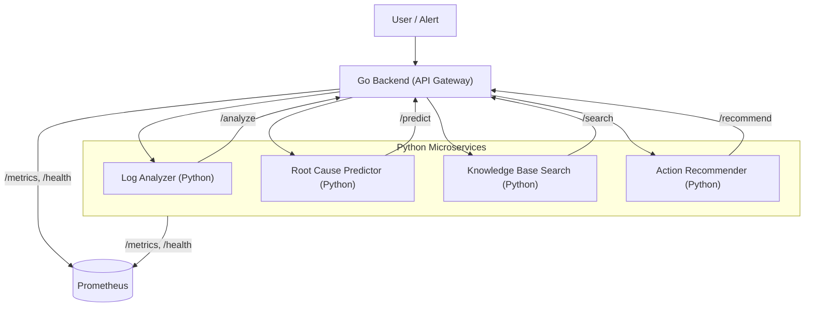

# AI-Powered Incident Resolution Assistant for DevOps Teams

## Project Overview
A smart assistant that helps DevOps/SRE teams diagnose and resolve production issues faster using AI. It leverages log analysis, knowledge base search, root cause prediction, and action recommendation—all powered by ML.

## Architecture
- **Go Backend**: Orchestrates requests, exposes unified API.
- **Python Microservices**:
  - **Log Analyzer**: ML-based anomaly detection (Isolation Forest + NLP)
  - **Root Cause Predictor**: ML classifier (LogisticRegression)
  - **Knowledge Base Search**: Semantic search (sentence-transformers + FAISS)
  - **Action Recommender**: ML-based (LogisticRegression)

### System Design Diagram



### Request/Response Flow
1. **User/Alert** triggers a request to the Go Backend (API Gateway).
2. **Go Backend** receives the request and routes it to the appropriate Python microservice:
   - `/analyze` → Log Analyzer
   - `/predict` → Root Cause Predictor
   - `/search` → Knowledge Base Search
   - `/recommend` → Action Recommender
3. Each **Python microservice** processes the request (using ML/NLP/Vector Search) and returns a response to the Go Backend.
4. **Go Backend** aggregates and returns the result to the user or alerting system.
5. All services expose `/health` and `/metrics` endpoints for monitoring (e.g., Prometheus).

## Setup & Running

### Prerequisites
- Docker & Docker Compose
- Python 3.10+ (for local dev/tests)
- Go 1.21+

### Local Development
1. Clone the repo and create a virtual environment:
   ```sh
   python3 -m venv venv
   source venv/bin/activate
   pip install -r python-services/requirements.txt
   ```
2. Copy `.env.example` to `.env` and fill in any required values.
3. Run tests:
   ```sh
   ./run_all_tests.sh
   ```

### Docker Compose (Recommended)
1. Build and start all services:
   ```sh
   docker-compose up --build
   ```
2. The Go API will be available at `http://localhost:8080`.

## API Endpoints

### Go Backend (Unified API)
- `POST /analyze` — Analyze logs for anomalies
- `POST /predict` — Predict root cause from logs
- `POST /search` — Search similar incidents (vector search)
- `POST /recommend` — Recommend actions based on root cause
- `GET /health` — Health check

### Python Microservices
Each exposes its own `/health`, `/metrics`, and main endpoint (see code for details).

## Configuration
- All services are configured via environment variables (see `.env.example`).
- ML model parameters and keywords can be set via env vars.

## Testing
- Run all tests (unit, integration, end-to-end):
  ```sh
  ./run_all_tests.sh
  ```
- See `test_e2e.py` for a full incident scenario test.

## Monitoring with Prometheus
- All services expose a `/metrics` endpoint compatible with Prometheus scraping.
- Example Prometheus scrape config:
  ```yaml
  scrape_configs:
    - job_name: 'incident-assistant'
      static_configs:
        - targets:
            - 'localhost:8080'  # Go backend
            - 'localhost:8001'  # Log Analyzer
            - 'localhost:8002'  # Root Cause Predictor
            - 'localhost:8003'  # Knowledge Base
            - 'localhost:8004'  # Action Recommender
  ```
- **Metrics available:**
  - `*_requests_total` — Total requests per endpoint
  - `*_errors_total` — Total errors per endpoint
  - `*_anomalies_total`, `*_predictions_total`, `*_recommendations_total`, `*_searches_total` — Custom metrics per service
- You can visualize and alert on these metrics using Prometheus and Grafana.

## Extending/Customizing
- **ML Models**: Replace or retrain models in each microservice as needed.
- **Knowledge Base**: Add more incidents/docs to `INCIDENTS` in `knowledge_base/vector_search.py` or connect to a real DB.
- **Integrations**: Add Slack, Teams, or other chat/alert integrations in the `integrations/` directory.

## Production Notes
- All services have `/health` and `/metrics` endpoints for orchestration/monitoring.
- Use Docker Compose or Kubernetes for deployment.
- Ensure secrets are managed securely (do not commit real secrets).
- Add logging/monitoring as needed for your environment.

---
This project is production-ready and easy to extend for your team's needs! 