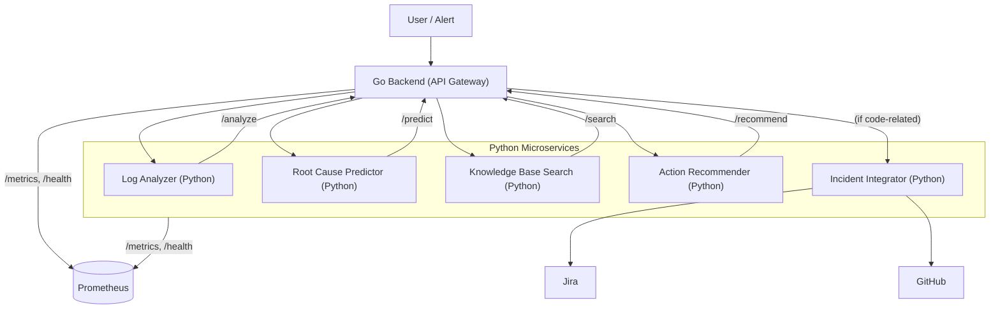

# AI-Powered Incident Resolution Assistant for DevOps Teams

## Project Overview
A smart assistant that helps DevOps/SRE teams diagnose and resolve production issues faster using AI. It leverages log analysis, knowledge base search, root cause prediction, and action recommendation—all powered by ML.

## Architecture
- **Go Backend**: Orchestrates requests, exposes unified API, and conditionally triggers the Incident Integrator for code-related incidents.
- **Python Microservices**:
  - **Log Analyzer**: ML-based anomaly detection (Isolation Forest + NLP)
  - **Root Cause Predictor**: ML classifier (LogisticRegression)
  - **Knowledge Base Search**: Semantic search (sentence-transformers + FAISS)
  - **Action Recommender**: ML-based (LogisticRegression)
  - **Incident Integrator**: Integrates with GitHub and Jira to automate ticketing and closure for code-related incidents.
- **React Frontend**: Modern web dashboard for monitoring services, analyzing incidents, running tests, and managing configuration.

### System Design Diagram



### Request/Response Flow
1. **User/Alert** triggers a request to the Go Backend (API Gateway).
2. **Go Backend** receives the request and routes it to the appropriate Python microservice:
   - `/analyze` → Log Analyzer
   - `/predict` → Root Cause Predictor
   - `/search` → Knowledge Base Search
   - `/recommend` → Action Recommender
3. Each **Python microservice** processes the request (using ML/NLP/Vector Search) and returns a response to the Go Backend.
4. **Go Backend** aggregates and returns the result to the user or alerting system.
5. **If the root cause is code-related** (as determined by keywords in `code_keywords.txt`), the Go Backend triggers the Incident Integrator by sending an incident event.
6. **Incident Integrator** checks for existing Jira tickets, assigns to the relevant developer, and monitors GitHub for PRs that fix the issue. When a fix is merged, it automatically closes the Jira ticket.
7. All services expose `/health` and `/metrics` endpoints for monitoring (e.g., Prometheus).

## Example Flow: End-to-End Incident Resolution

Suppose an alerting system detects unusual activity in your production logs and sends a request to the Go Backend. Here's how the system processes the incident:

### 1. **Log Analysis**
- **Input:** The alerting system (or user) sends a POST request to `/analyze` with recent log lines:
  ```json
  {
    "logs": [
      "2024-07-07 12:00:01 ERROR Database connection failed",
      "2024-07-07 12:00:02 WARN Retrying connection",
      "2024-07-07 12:00:03 ERROR Database connection failed"
    ]
  }
  ```
- **Processing:** The Go Backend forwards this to the Log Analyzer service, which uses ML/NLP to detect anomalies and extract key events.
- **Output:** The Log Analyzer returns a summary of anomalies and relevant log events.

### 2. **Root Cause Prediction**
- **Input:** The Go Backend sends the analyzed log events to the Root Cause Predictor via `/predict`.
- **Processing:** The Root Cause Predictor uses a trained ML model to infer the most likely root cause (e.g., "Database outage").
- **Output:** The predicted root cause is returned to the Go Backend.

### 3. **Knowledge Base Search**
- **Input:** The Go Backend queries the Knowledge Base service at `/search` with the root cause or log context.
- **Processing:** The Knowledge Base uses semantic vector search to find similar past incidents and their resolutions.
- **Output:** A list of similar incidents and their solutions is returned.

### 4. **Action Recommendation**
- **Input:** The Go Backend sends the root cause and context to the Action Recommender at `/recommend`.
- **Processing:** The Action Recommender suggests concrete remediation steps (e.g., "Restart the database service").
- **Output:** Recommended actions are returned.

### 5. **Aggregated Response**
- **Output:** The Go Backend aggregates all results and returns a unified response to the user or alerting system:
  ```json
  {
    "anomalies": [...],
    "root_cause": "Database outage",
    "similar_incidents": [
      {"id": 42, "summary": "2023-11-01: Database outage due to network partition", "resolution": "Restarted DB and fixed network config"}
    ],
    "recommended_actions": [
      "Check database server status",
      "Restart the database service",
      "Verify network connectivity"
    ]
  }
  ```

### 6. **Monitoring**
- All services expose `/metrics` and `/health` endpoints for observability and orchestration.

## Setup & Running

### Prerequisites
- Docker & Docker Compose
- Python 3.10+ (for local dev/tests)
- Go 1.21+

### Local Development
1. Clone the repo and create a virtual environment:
   ```sh
   python3 -m venv venv
   source venv/bin/activate
   pip install -r python-services/requirements.txt
   ```
2. Copy `.env.example` to `.env` and fill in any required values.
3. Run tests:
   ```sh
   ./run_all_tests.sh
   ```

### Frontend Development
1. Navigate to the frontend directory and install dependencies:
   ```sh
   cd frontend
   npm install
   ```
2. Start the development server:
   ```sh
   npm start
   ```
3. The dashboard will be available at `http://localhost:3000`

### Docker Compose (Recommended)
1. Build and start all services:
   ```sh
   docker-compose up --build

2. The Go API will be available at `http://localhost:8080`.
3. For the frontend, navigate to `frontend/` and run:
   ```sh
   npm install && npm start
   ```
4. The dashboard will be available at `http://localhost:3000`.

## API Endpoints

### Go Backend (Unified API)
- `POST /analyze` — Analyze logs for anomalies
- `POST /predict` — Predict root cause from logs
- `POST /search` — Search similar incidents (vector search)
- `POST /recommend` — Recommend actions based on root cause
- `GET /health` — Health check

### Python Microservices
Each exposes its own `/health`, `/metrics`, and main endpoint (see code for details).

## Configuration
- All services are configured via environment variables (see `.env.example`).
- ML model parameters and keywords can be set via env vars.

## Testing
- Run all tests (unit, integration, end-to-end):
  ```sh
  ./run_all_tests.sh
  ```
- See `test_e2e.py` for a full incident scenario test.

## Monitoring with Prometheus
- All services expose a `/metrics` endpoint compatible with Prometheus scraping.
- Example Prometheus scrape config:
  ```yaml
  scrape_configs:
    - job_name: 'incident-assistant'
      static_configs:
        - targets:
            - 'localhost:8080'  # Go backend
            - 'localhost:8001'  # Log Analyzer
            - 'localhost:8002'  # Root Cause Predictor
            - 'localhost:8003'  # Knowledge Base
            - 'localhost:8004'  # Action Recommender
  ```
- **Metrics available:**
  - `*_requests_total` — Total requests per endpoint
  - `*_errors_total` — Total errors per endpoint
  - `*_anomalies_total`, `*_predictions_total`, `*_recommendations_total`, `*_searches_total` — Custom metrics per service
- You can visualize and alert on these metrics using Prometheus and Grafana.

## Extending/Customizing
- **ML Models**: Replace or retrain models in each microservice as needed.
- **Knowledge Base**: Add more incidents/docs to `INCIDENTS` in `knowledge_base/vector_search.py` or connect to a real DB.
- **Integrations**: Add Slack, Teams, or other chat/alert integrations in the `integrations/` directory.

## Production Notes
- All services have `/health` and `/metrics` endpoints for orchestration/monitoring.
- Use Docker Compose or Kubernetes for deployment.
- Ensure secrets are managed securely (do not commit real secrets).
- Add logging/monitoring as needed for your environment.

---
This project is production-ready and easy to extend for your team's needs! 

---

This error means the Go backend (running in Docker) is trying to reach the Log Analyzer at `http://localhost:8001`, but it gets "connection refused". This is a classic Docker networking issue.

**Why?**
- When the Go backend runs in a Docker container, `localhost` refers to the container itself, not your host.
- The Log Analyzer is running in a different container, so `localhost:8001` does not work from inside the Go backend container.
- In Docker Compose, containers communicate using their service names (e.g., `log-analyzer:8000`).

---

## **How to Fix**

### 1. **Use Docker service names for internal requests**

- In your Go backend, set the URLs for the Python services to use the Docker Compose service names:
  - Log Analyzer: `http://log-analyzer:8000/analyze`
  - Root Cause Predictor: `http://root-cause-predictor:8000/predict`
  - Knowledge Base: `http://knowledge-base:8000/search`
  - Action Recommender: `http://action-recommender:8000/recommend`
  - Incident Integrator: `http://incident-integrator:8000/incident`

**These are already the defaults in your Go backend if you do not override the environment variables.**

---

### 2. **Frontend should use `localhost:8001`, Backend should use service names**

- **Frontend** (browser) talks to `localhost:8001`, etc.
- **Go backend** (in Docker) talks to `log-analyzer:8000`, etc.

---

### 3. **How to set this up**

- In your Go backend Docker Compose service, **do not override the URLs to use `localhost`**.
- If you POST to `/config` with `localhost:8001` etc., the Go backend will try to use those, which will fail in Docker.
- **Let the Go backend use the default service names for internal calls.**

---

### 4. **How to fix your config**

**Reset the config to use Docker service names:**

```bash
curl -X POST http://localhost:8080/config -H "Content-Type: application/json" -d '{
  "log_analyzer_url": "http://log-analyzer:8000/analyze",
  "root_cause_predictor_url": "http://root-cause-predictor:8000/predict",
  "knowledge_base_url": "http://knowledge-base:8000/search",
  "action_recommender_url": "http://action-recommender:8000/recommend",
  "incident_integrator_url": "http://incident-integrator:8000/incident"
}'
```

---

### 5. **Summary Table**

| Who         | URL to use for Log Analyzer      |
|-------------|----------------------------------|
| Frontend    | http://localhost:8001            |
| Go backend  | http://log-analyzer:8000/analyze |

---

**After you reset the config, the error will go away.**  
Let me know if you want this automated or if you need help with any other part! 

---

To reset the config so your Go backend uses the correct Docker service names (and not `localhost`), just run this command from your host terminal:

```bash
curl -X POST http://localhost:8080/config -H "Content-Type: application/json" -d '{
  "log_analyzer_url": "http://log-analyzer:8000/analyze",
  "root_cause_predictor_url": "http://root-cause-predictor:8000/predict",
  "knowledge_base_url": "http://knowledge-base:8000/search",
  "action_recommender_url": "http://action-recommender:8000/recommend",
  "incident_integrator_url": "http://incident-integrator:8000/incident"
}'
```

**What this does:**
- It tells the Go backend (running in Docker) to use the Docker Compose service names for all internal requests.
- This will fix the "connection refused" errors.

**After running this:**
- The Go backend will be able to talk to all Python services.
- Your frontend will still use `localhost:8001`, etc. (which is correct for browser-to-container communication).

**You can verify the config was reset by running:**
```bash
curl http://localhost:8080/config
```
You should see the URLs set to the Docker service names.

Let me know if you want a button for this in the UI or need any more help! 